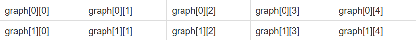

# 백준 9465번 - 스티커

```python
T = int(input())
for _ in range(T):
    n = int(input())
    arr = [list(map(int, input().split())) for _ in range(2)]

    # 열이 하나면 각 행의 첫번째 스티커에서 최대값 출력
    if n == 1:
        print(max(arr[0][0], arr[1][0]))
        continue

    # 각 행의 대각선 값 더해줌
    arr[0][1] += arr[1][0]
    arr[1][1] += arr[0][0]

    # 나머지 열 돌면서
    # 바로 전 대각선 값이랑 전전 대각선 값에서 최댓값 찾아줌
    for i in range(2, n):
        arr[0][i] += max(arr[1][i - 1], arr[1][i - 2])
        arr[1][i] += max(arr[0][i - 1], arr[0][i - 2])

    # 마지막 열의 두 스티커값 중 최대값 뽑기
    print(max(arr[0][n - 1], arr[1][n - 1]))

```


